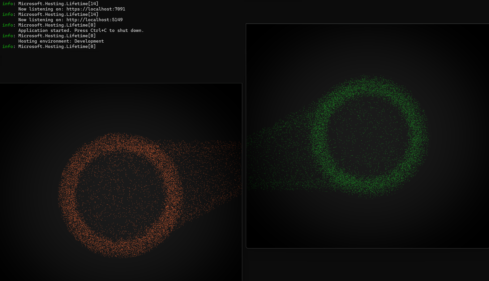

# Real-Time Particle Energy System

This project is a real-time particle simulation connecting energy orbs between two windows, built with a combination of **Vite + React**, **ASP.NET 8 SignalR**, and **Three.js**. The application enables two separate windows to interactively share a particle-based energy orb system in real-time, creating a visually engaging and responsive experience.

## Features

- **Real-Time Connectivity**: Utilizes ASP.NET 8 SignalR to facilitate real-time updates between connected windows.
- **Particle System**: Built using Three.js to create dynamic and visually compelling particle energy orbs.
- **Cross-Window Interaction**: Particle orbs' energy states are shared across two windows, reflecting real-time changes in both.
- **Modern Frontend**: Developed with Vite and React, ensuring a fast and responsive user experience.

### Real-Time Particle Connection

This feature allows two windows to interactively connect, sharing particle-based energy orb rendered with Three.js in real-time.



## Technologies

- **Frontend**: Vite, React
- **Real-Time Communication**: ASP.NET 8 SignalR
- **3D Graphics and Particle System**: Three.js
- **Backend**: ASP.NET Core 8

## Getting Started

### Prerequisites

- **Node.js** (version 16+ recommended)
- **ASP.NET Core SDK** (version 8+)

### Setup

1. **Clone the repository**:

   Clone this repository to your local machine and navigate into the project directory:

   ```bash
   git clone https://github.com/SuhibAlsaggar/energy-orb-simulation.git
   cd energy-orb-simulation
   ```

2. **Install frontend dependencies**:

   Navigate to the frontend directory (where `package.json` is located) and install dependencies:

   ```bash
   cd front-end
   npm install
   ```

3. **Build the frontend**:

   ```bash
   npm run build
   ```

4. **Install backend dependencies**:

   Navigate to the backend ASP.NET directory (where `ParticleSystemBackend.csproj` is located):

   ```bash
   dotnet restore
   ```

### Running the Project

1. **Start the backend (ASP.NET Core)**:

   ```bash
   dotnet run --project back-end/ParticleSystemBackend/ParticleSystemBackend.csproj
   ```

2. **Start the frontend (Vite)**:

   Open a new terminal in the `front-end` directory:

   ```bash
   npm run dev
   ```

3. **Open two browser windows** and navigate to the frontend application URL. Each window will represent one participant in the real-time energy orb system.

## Usage

1. Interact with the particle energy orb in either window.
2. The energy orb state will be synchronized in real-time between both windows, showcasing dynamic interaction and energy sharing.

## Project Structure

```
/root
├── front-end          # Vite + React project files
│   ├── src           # React components and Three.js setup
│   └── public        # Static assets
├── back-end           # ASP.NET Core SignalR project
│   ├── Hubs          # SignalR hubs and methods for real-time communication
└── README.md         # Project readme
```
